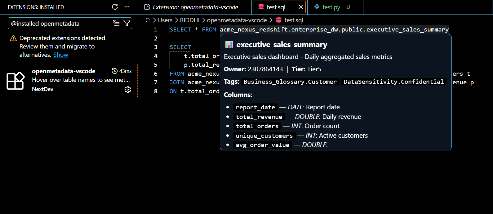
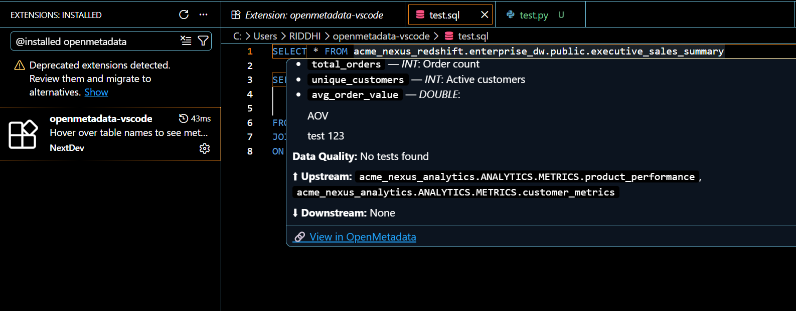

# OpenMetadata for VS Code

> Bring your data catalog directly into your editor, no tab switching, no context loss.

## The Problem

Data engineers constantly switch between their editor and the OpenMetadata 
browser to check table descriptions, ownership, data quality, and lineage. 
This breaks flow and slows down development.

## The Solution

A VS Code extension that shows live OpenMetadata information the moment 
you hover over a table name in your SQL, Python, or dbt YAML files.

No browser. No switching. Just hover.

---

## Demo




---

## Features

| Feature | Description |
|---|---|
|  **Hover Tooltips** | Hover over any table name to see description, owner, tier, tags and columns |
|  **Lineage** | See upstream and downstream tables inline |
|  **Data Quality** | View DQ test results without opening the browser |
|  **Search** | `Ctrl+Shift+P` → OpenMetadata: Search Tables |
|  **Smart Caching** | Stale-while-revalidate cache — instant on repeat hovers |
|  **Alias Resolution** | Hover over SQL aliases like `o` and resolves to the full table |
|  **Any Instance** | Works with sandbox, self-hosted, or cloud OpenMetadata |

---

## Supported File Types

- SQL — `.sql`
- Python — `.py`
- dbt YAML — `.yml`, `.yaml`

---

## Quick Start for Judges

### Step 1 — Install the extension

Download `openmetadata-vscode-0.0.1.vsix` from the [Releases](https://github.com/riddhij-7/openmetadata-vscode/releases) page.

In VS Code:
- Extensions sidebar → `...` three dots → Install from VSIX → select the file
- Restart VS Code

### Step 2 — Get a sandbox token

1. Go to [sandbox.open-metadata.org](https://sandbox.open-metadata.org) and sign up
2. Click your profile (top right) → Settings
3. Go to **Access Token** tab
4. Copy the token

### Step 3 — Configure the extension

VS Code Settings (`Ctrl+,`) → search `openmetadata` → set:
- **Server URL:** `https://sandbox.open-metadata.org`
- **Token:** paste your token here

### Step 4 — Open a SQL file and hover

Create a new file `test.sql` and paste:

```sql
SELECT * FROM acme_nexus_redshift.enterprise_dw.public.executive_sales_summary

SELECT 
    t.total_orders,
    p.total_revenue
FROM acme_nexus_redshift.enterprise_dw.public.executive_sales_summary.total_orders t
JOIN acme_nexus_redshift.enterprise_dw.public.executive_sales_summary.total_revenue p
ON t.total_orders = p.total_revenue;
```
You can download and use the sample test files in .sql, .yml, or .py from the repository.

Hover over `acme_nexus_raw_data.acme_raw.sales.orders` — you will see
the metadata tooltip appear with description, owner, tier, tags, 
columns, lineage and data quality.

Also try hovering over just `o` — it resolves the alias to the full table.

---

## Architecture

```text
Cursor moves over word
↓
Prefetcher warms cache in background
↓
User hovers
→ HoverProvider fires
↓
MetadataCache.get(word)
├── fresh → return instantly
├── stale → return instantly + refresh
└── miss → fetch API → cache → return

OpenMetadataClient
├── /api/v1/tables/name/{fqn}
├── /api/v1/lineage/getLineage
└── /api/v1/dataQuality/testCases

---

## How We Used OpenMetadata

We integrated 3 OpenMetadata REST API endpoints:

- **`/api/v1/tables/name/{fqn}`** — fetches table metadata including
  description, owners, tier, tags and columns
- **`/api/v1/lineage/getLineage`** — fetches upstream and downstream
  lineage graph for any table
- **`/api/v1/dataQuality/testCases`** — fetches recent DQ test results
  for a table

The extension is fully configurable — point it at any OpenMetadata 
instance by changing the server URL in VS Code settings.

---

## Tech Stack

- TypeScript
- VS Code Extension API
- OpenMetadata REST API

---


| Criteria | What we built |
|---|---|
|  Potential Impact | Every data engineer using VS Code benefits — zero workflow disruption |
|  Creativity & Innovation | First VS Code extension for OpenMetadata with alias resolution + predictive prefetch |
|  Technical Excellence | Stale-while-revalidate cache, request deduplication, dead state tracking, 5s timeout |
|  Best Use of OpenMetadata | Tables, lineage and DQ APIs — all three core pillars integrated |
|  User Experience | Zero config needed, works instantly, tooltip is clean and informative |
|  Presentation Quality | Live demo, clear README, architecture diagram, YouTube walkthrough |

---

Built for the WeMakeDevs x OpenMetadata Hackathon 2026
